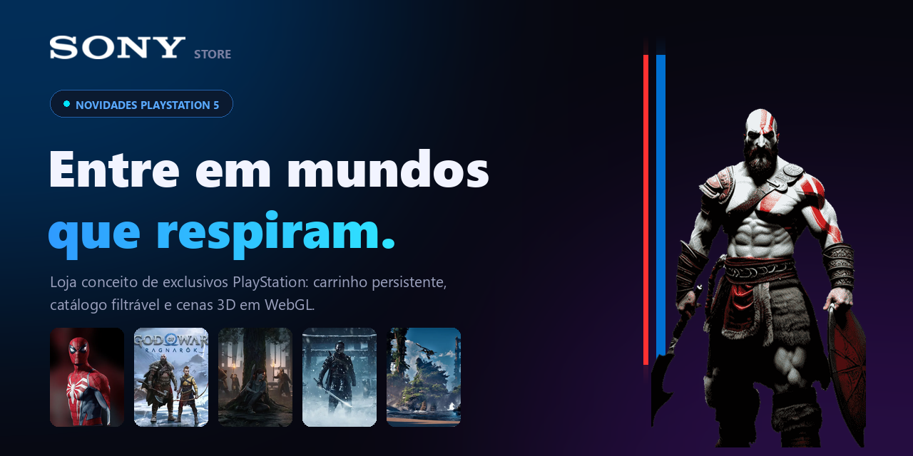

<div align="center">



# Sony Store

Loja conceito de exclusivos PlayStation, feita em Angular 17 com cenas 3D em WebGL.

[**Ver online →**](https://sony-gilt.vercel.app/)


</div>

---

## Sobre

Uma vitrine de e-commerce construída para exercitar o que o Angular moderno oferece —
signals, componentes standalone, control flow novo e carregamento diferido — sem abrir mão
de um visual que sustente a comparação com a loja real.

A parte gráfica é Three.js puro: chuva com relâmpagos no plano de fundo e um carrossel 3D
de capas que responde ao arraste do mouse.

## Funcionalidades

**Carrinho**
Estado inteiro em signals, com `computed` para contagem, subtotal e economia acumulada.
Sobrevive ao refresh via `localStorage`, abre em painel lateral, fecha no `Esc` e trava o
scroll do body enquanto está aberto. Barra de progresso até o frete grátis.

**Catálogo**
Busca por texto, filtro por categoria e ordenação (preço, avaliação, nome) — tudo derivado
de um único `computed`, sem estado duplicado. Barra de filtros fixa no topo e estado vazio
com ação de limpar.

**Cenas 3D**
Carrossel de capas arrastável com reflexo e legendas em geometria de texto. Ao fundo, chuva
com 2 000 gotas, névoa em camadas e relâmpagos intermitentes.

**Acabamento**
Design tokens em CSS custom properties, layout responsivo do celular ao ultrawide, rotas
com carregamento diferido, preços via `CurrencyPipe` em pt-BR e `prefers-reduced-motion`
respeitado em toda animação.

## Decisões de performance

O projeto nasceu bonito e pesado. O que foi feito para corrigir isso:

| Problema | Solução |
| --- | --- |
| 2 000 `Mesh` na chuva = 2 000 draw calls por quadro | Um único `InstancedMesh`; as posições são escritas direto no `instanceMatrix.array` |
| Capas de 1366×768 baixadas 3× cada (card + textura + reflexo) | Variantes dedicadas por uso, `srcset` nos cards e reaproveitamento da textura já decodificada no reflexo |
| Fonte de 62 KB do carrossel baixada 6× | `THREE.Cache` ligado e uma única `Promise` de fonte compartilhada |
| Loops de render disparando change detection a 60fps | `NgZone.runOutsideAngular` nos dois renderizadores |
| Cenas 3D rodando fora da tela | `IntersectionObserver` no carrossel e pausa em `visibilitychange` |
| Fundo WebGL travando máquinas sem GPU | Detecção de rasterização por software; nesses casos o fundo não inicia |
| Three.js no caminho crítico da home | `@defer (on viewport)` no carrossel, `@defer (on idle)` no fundo |

Resultado medido no Lighthouse: payload de imagem de **2 234 KiB → 118 KiB** e cadeia crítica
de requisições de **5 256 ms → 860 ms**. O bundle da home caiu de 34,1 kB para 15,4 kB.

## Rodando localmente

Requer Node 20.9+ (o deploy usa 24.x).

```bash
git clone https://github.com/desafiogamer/Sony.git
cd Sony
npm install
npm start
```

Disponível em `http://localhost:4200`.

```bash
npm run build     # build de produção em dist/sony
```

## Estrutura

```
src/app/
├── components/            # Header, carrinho, toast e as cenas 3D
│   ├── cart-drawer/
│   ├── carousel/          # Carrossel 3D de capas
│   ├── header/
│   ├── modelo-3-d/        # Chuva, névoa e relâmpagos de fundo
│   └── toast/
├── core/services/         # CartService, ProductsService, ToastService
└── modules/Sony/
    ├── components/        # ProductCard e elementos decorativos do hero
    ├── interfaces/
    └── pages/             # Início e Produtos
```

As imagens ficam em `src/assets/img/`: os originais na raiz, recortes 460×613 em `cards/`
(com `sm/` a 320×427 para o `srcset`) e texturas 512×288 em `carousel/`.

## Créditos

Projeto de estudo, sem vínculo com a Sony Interactive Entertainment. As artes dos jogos
pertencem a seus respectivos estúdios e aparecem aqui apenas para fins de demonstração.

Feito por [João Vitor Gentil da Silva](https://github.com/desafiogamer).
